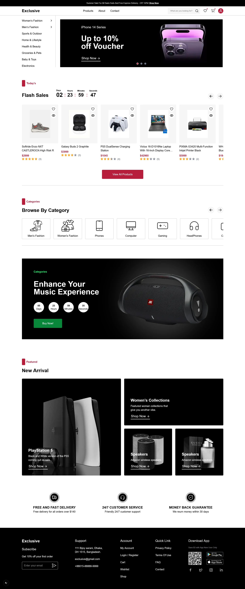
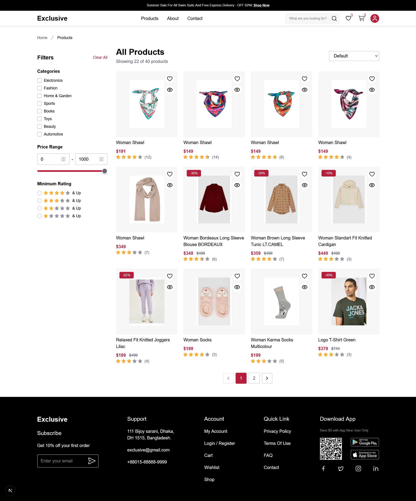
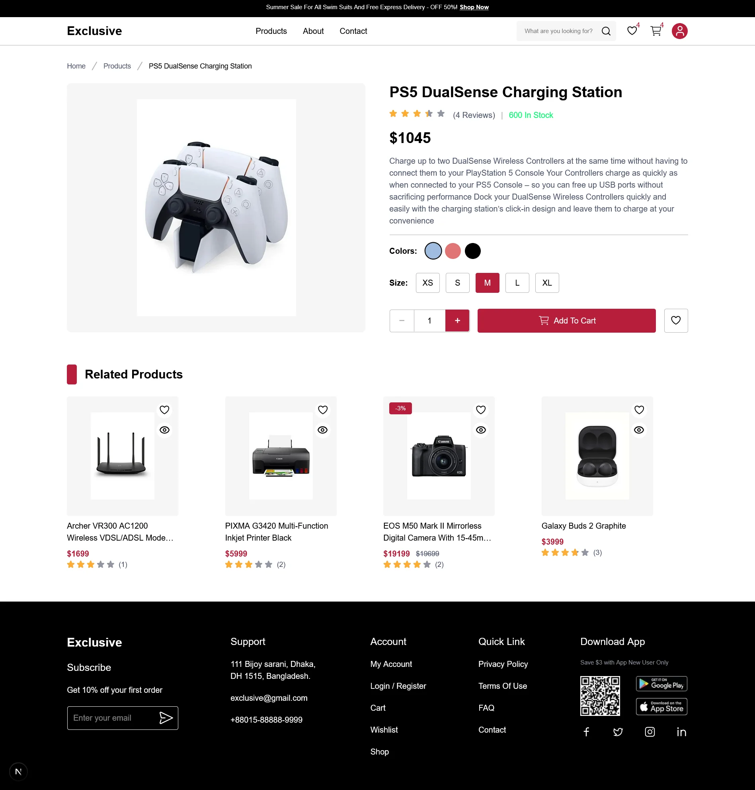
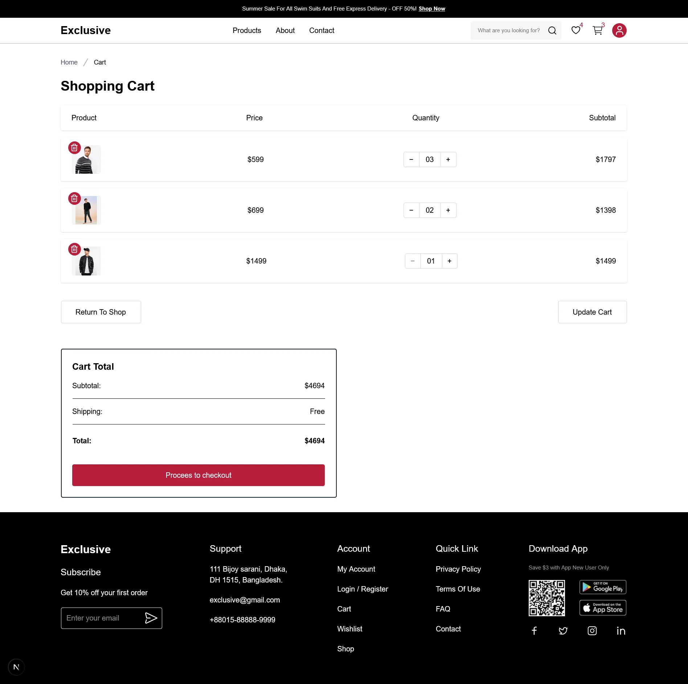
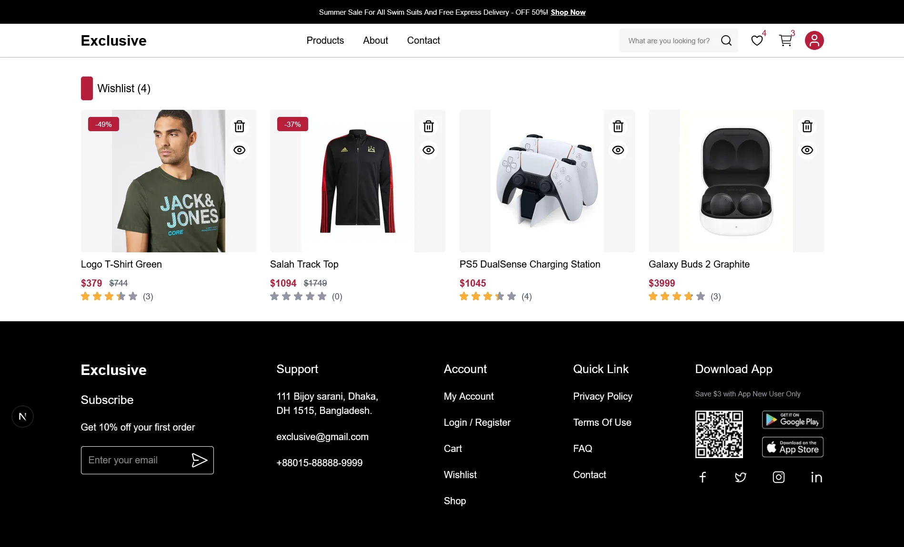
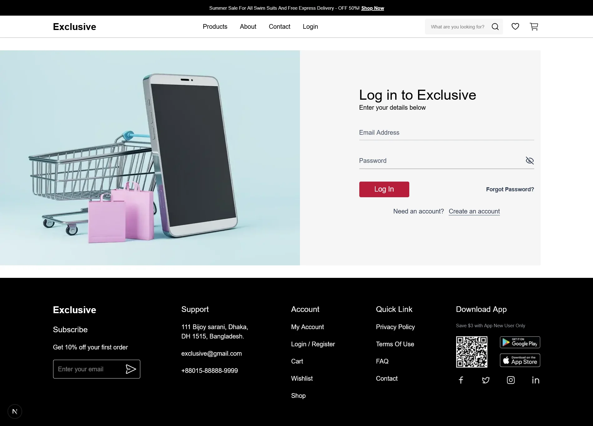
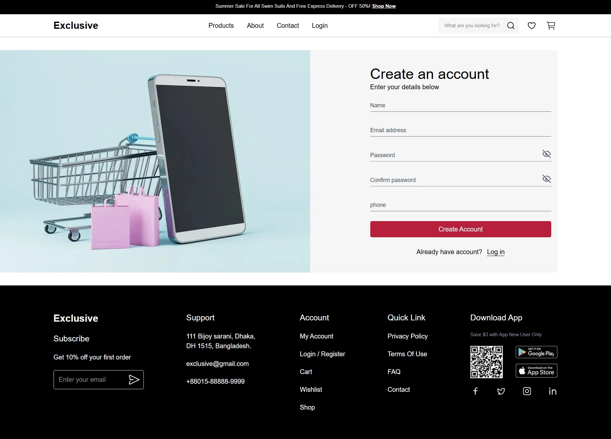

# 🛒 E-Commerce Next.js

A modern, full-featured e-commerce web application built with **Next.js 16**, **TypeScript**, and **Tailwind CSS** — designed with **Clean Architecture** principles, optimized for **SEO**, **Accessibility**, **Performance**, and **Best Practices**.

[](https://ecommerce-next-tsx.vercel.app/)

---

## Preview

### Home Page


### Products Page


### Product Details


### Cart List


### Wishlist


### Login


### Sign Up


---

## Clean Architecture

This project follows **Clean Architecture** principles to ensure a clear separation of concerns, maintainability, and scalability.

```
src/
├── app/                        # Presentation Layer (Next.js App Router)
│   ├── (auth)/                 # Auth routes (Login, Sign Up)
│   ├── (home)/                 # Home page
│   └── (routes)/               # App routes (Products, Cart, Wishlist, Account, About, Contact)
│
├── components/                 # UI Layer
│   ├── common/                 # Shared components (Navbar, Footer, Pagination, Breadcrumb, Toast)
│   ├── features/               # Feature-specific components
│   │   ├── ProductCard/
│   │   ├── FilterSidebar/
│   │   ├── ImageGallery/
│   │   ├── AddToCartButton/
│   │   ├── FavoriteButton/
│   │   ├── QuantitySelector/
│   │   └── Sidebar/
│   ├── LoginForm/
│   ├── SignUpForm/
│   └── ForgotPasswordModal/
│
├── context/                    # State Management Layer
│   ├── AppProvider.tsx          # Root context provider
│   ├── GetProductsContext.tsx   # Products state & filtering logic
│   └── ToastContext.tsx         # Global toast notifications
│
├── services/                   # Data / API Layer
│   ├── apiClient.ts             # Axios instance & interceptors
│   ├── endpoints.ts             # Centralized API endpoint definitions
│   ├── productService.ts        # Product API calls
│   ├── cartService.ts           # Cart API calls
│   ├── wishlistService.ts       # Wishlist API calls
│   ├── authService.ts           # Authentication API calls
│   └── addressService.ts        # Address API calls
│
└── types/                      # TypeScript Type Definitions
```

### Architecture Highlights

| Layer | Responsibility |
|---|---|
| **Presentation (`app/`)** | Pages and routing via Next.js App Router |
| **UI (`components/`)** | Reusable, composable UI components |
| **State (`context/`)** | Global state management with React Context |
| **Data (`services/`)** | All API calls isolated and centralized |
| **Types (`types/`)** | Shared TypeScript interfaces and types |

---

## SEO

- **`<title>` and `<meta description>`** defined per page using Next.js `generateMetadata`
- **Open Graph image** (`og-image.webp`) for rich social sharing previews
- **Semantic HTML** structure with proper use of `<header>`, `<main>`, `<section>`, `<nav>`, `<footer>`
- **Next.js Image** component for optimized, lazy-loaded images with proper `alt` attributes
- **Canonical URLs** handled automatically by Next.js App Router

---

## Accessibility

- **ARIA attributes** used on interactive elements (buttons, modals, form controls)
- **Keyboard navigable** components throughout the app
- **Proper heading hierarchy** (`h1` → `h2` → `h3`) maintained on every page
- **Focus management** on modals and dynamic content (e.g., ForgotPasswordModal)
- **Color contrast** compliant with WCAG AA standards via Tailwind's curated palette
- **Form labels** explicitly associated with inputs for screen reader support

---

## Performance

- **Next.js App Router** with React Server Components (RSC) for reduced client-side JS
- **`next/image`** for automatic responsive images, WebP/AVIF conversion, and lazy loading
- **Code splitting** out of the box via Next.js dynamic routing
- **Axios interceptors** for efficient, centralized HTTP request management
- **Turbopack** enabled in development for blazing-fast HMR
- **Static assets** in `/public` served with caching headers by Next.js

---

## Best Practices

- **TypeScript** for full type safety across the entire codebase
- **Formik + Yup** for robust, schema-validated forms
- **Centralized API layer** — all API calls go through `services/`, never directly from components
- **Environment-based configuration** with `.env` for API base URLs and secrets
- **Consistent error handling** with toast notifications via `ToastContext`
- **ESLint** configured with Next.js recommended rules for code quality
- **Cookie management** via `cookies-next` for secure auth token handling

---

## Getting Started

### Prerequisites

- Node.js `>= 18`
- npm or yarn

### Installation

```bash
# Clone the repository
git clone https://github.com/your-username/ecommerce-next.tsx.git

# Navigate to the project directory
cd ecommerce-next.tsx

# Install dependencies
npm install
```

### Development

```bash
npm run dev
```

Open [http://localhost:3000](http://localhost:3000) in your browser.

### Build for Production

```bash
npm run build
npm run start
```

---

## Tech Stack

| Technology | Purpose |
|---|---|
| **Next.js 16** | React framework with App Router |
| **React 19** | UI library |
| **TypeScript** | Static type checking |
| **Tailwind CSS 4** | Utility-first styling |
| **Axios** | HTTP client |
| **Formik + Yup** | Form handling & validation |
| **cookies-next** | Cookie management for auth |
| **ESLint** | Code linting |